# A.M.V. (Veterinary Medical Assistance) — Version 2.10

### Welcome to my humble happy place.

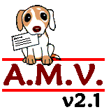

A friend once told me that programming in HTML was easy. I looked for information and found a tutorial on HTML and another one on BASIC.

With a 386 computer, I wrote this code without knowing much about programming. I searched for information in the early days of the Internet, saved everything I found on floppy disks, and tried to build this program piece by piece.

I eventually sold it to 4 veterinary clinics. That was in 2002. And 24 years later, I am still surprised by what I managed to create.

It is not intended to compete with modern software; it is a snapshot of how I solved real software problems with the resources available at the time.

AMV was not written entirely in BASIC. Some interface operations were implemented in 8086 Assembly, directly using BIOS video functions to provide fast scrolling in help windows and data listings.

---

### 📂 Project Technical Profile

* **Name:** A.M.V. (Veterinary Medical Assistance)
* **Version:** 2.10
* **Release year:** 2002.
* **Architecture:** 16-bit (Designed for Intel 286 / 386 and above)
* **Languages:** Microsoft BASIC PDS 7.1 and 8086 Assembly.
* **Business model:** Commercial software, sold and successfully deployed in 4 veterinary clinics.

---

### 🛠️ Technical Highlights

* **Custom Database Engine:** Development of a persistent data storage system based on custom `TYPE` structures, completely avoiding external libraries.
* **Hardware-Level Interface Optimization:** Native 8086 Assembly routines integrated directly with BIOS video interrupts (`INT 10h`) to achieve extremely fast scrolling in help windows and data listings, overcoming the performance limitations of standard BASIC at the time.
* **Resource Efficiency:** A complete commercial system for billing, medical records, and accounting, optimized to run on mid-range computers with limited disk storage.
* **Code Evolution (Legacy Modernization):** Refactoring of the original hard-disk-based indexing algorithm into an optimized in-memory sorting system.

---

### 🗄️ The Treasure Files

* `*.BAS`: Main source code containing the business logic, workflows, and Spanish-language screens.
* `*.ASM`: Low-level Assembly modules controlling video and interface operations.
* `*.LIB`: Static libraries linked into the final executable.
* `*.PPT` (Windows 95): The original commercial presentation used to sell the software in 2002.
* `*.ICO`: A handcrafted pixel-art icon designed for the application shortcut.

---

### 📸 Screenshots

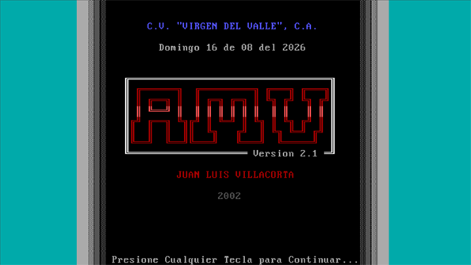
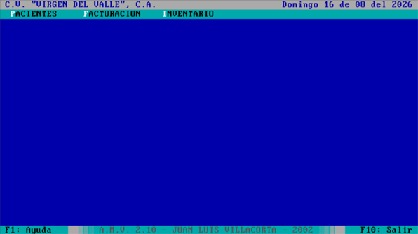
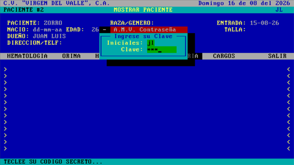
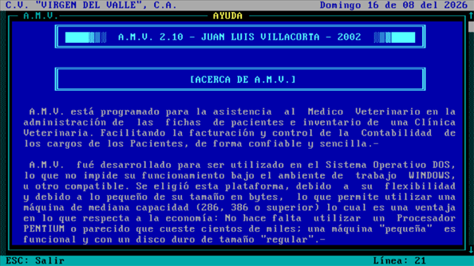
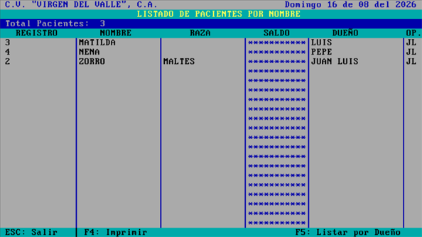
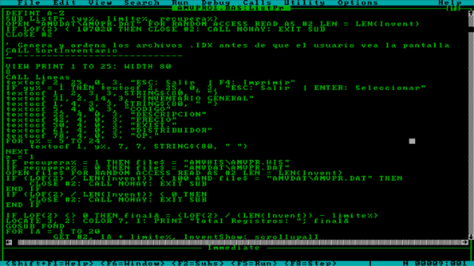

---

### 📄 Historical Documentation

* [Original EULA — A.M.V. v2.1 (2002)](licencia/LICENCIA.TXT): Historical license agreement included with the commercial release.
* [PowerPoint Presentation — A.M.V. v2.1 (2002)](ppt/AMV.pdf): Original presentation created in Microsoft PowerPoint for Windows 95 and preserved as a PDF.
* [A.M.V. v2.1 — 2002](screenshots/LOGO.BMP): Original logo and commercial materials preserved from the original release.

---

### 📸 Microsoft Office 95 PowerPoint Presentation / Screenshots

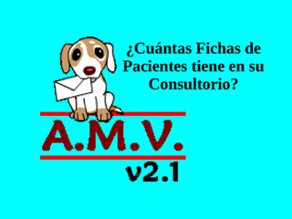
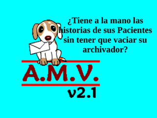
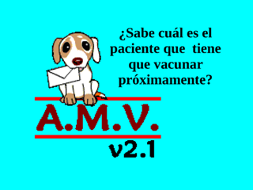
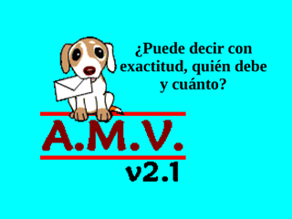
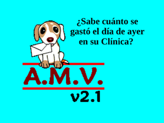
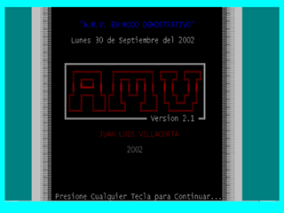

---

## Why Am I Publishing This Project?

This project is part of my history as a developer.

It was created in 2002, when I was programming on a 386 computer and teaching myself through books, tutorials, and whatever information I could find in the early days of the Internet.

I am not publishing it because 16-bit BASIC is a current technology, but because it represents an important stage in my learning: designing data structures, solving memory and performance problems, building my own database system, and taking software from an idea to real-world commercial use in veterinary clinics.

This repository preserves the code, tools, and part of the history of that project. For me, it is a way of showing not only which technologies I have used, but also how I learned to solve problems with them.

---

# A.M.V. (Asistencia al Médico Veterinario) — Versión 2.10

### Bienvenido a mi humilde lugar feliz.

Un amigo me dijo que programar en HTML era fácil. Busqué información y me encontré con un tutorial de HTML y otro de BASIC.

Con una máquina 386 hice este código sin saber mucho de programación. Busqué información en los inicios de Internet, guardaba en disquetes todo lo que encontraba y traté de tejer, pieza por pieza, este programa.

Llegué a venderlo a 4 veterinarias. Eso fue en 2002. Y 24 años después me sorprende lo que hice.

No pretende competir con el software actual; es una muestra de cómo resolvía problemas reales de software con los recursos disponibles en aquella época.

El AMV no fue solamente escrito en BASIC. Algunas operaciones de interfaz fueron implementadas en ensamblador 8086, utilizando directamente las funciones de vídeo de la BIOS, para proporcionar un desplazamiento rápido en las ventanas de ayuda y los listados.

---

### 📂 Ficha Técnica del Proyecto

*   **Nombre:** A.M.V. (Asistencia al Médico Veterinario)
*   **Versión:** 2.10
*   **Año de lanzamiento:** 2002.
*   **Arquitectura:** 16 bits (Diseñado para Intel 286 / 386 / superior)
*   **Lenguajes:** Microsoft BASIC PDS 7.1 y Ensamblador 8086.
*   **Modelo de Negocio:** Software comercial, vendido e implementado en 4 clínicas veterinarias.
  
---

### 🛠️ Logros Técnicos Destacados

*   **Motor de Base de Datos Propio:** Desarrollo de un sistema de almacenamiento persistente basado en estructuras de datos personalizadas (`TYPE`), prescindiendo por completo de librerías externas.
*   **Optimización de Interfaz vía Hardware:** Rutinas nativas en Ensamblador 8086 integradas directamente con las interrupciones de video de la BIOS (`INT 10h`) para lograr un desplazamiento (*scrolling*) ultrarrápido en ventanas de ayuda y listados, superando las limitaciones de rendimiento del BASIC estándar de la época.
*   **Eficiencia de Recursos:** Sistema comercial completo de facturación, historial médico y contabilidad optimizado para ejecutarse en equipos de mediana capacidad con almacenamiento limitado en disco.
*   **Evolución del Código (Legacy Modernization):** Refactorización del algoritmo de indexación original basado en disco duro hacia un sistema de ordenamiento (*sort*) optimizado directamente en memoria RAM.

---

### 🗄️ Archivos del Tesoro

*   `*.BAS`: Código fuente principal que contiene la lógica de negocio, flujos y pantallas en español.
*   `*.ASM`: Módulos de bajo nivel en ensamblador que controlan el video y la interfaz.
*   `*.LIB`: Librerías estáticas enlazadas para la compilación final.
*   `*.PPT` (Windows 95): La presentación comercial original utilizada para las ventas en 2002.
*   `*.ICO`: Icono pixelart artesanal diseñado a mano para el acceso directo.

---

### 📸 Capturas de Pantalla / Screenshots

---

### 📄 Documentación Histórica

*   [Original EULA — A.M.V. v2.1 (2002)](licencia/LICENCIA.TXT): Historical license agreement included with the commercial release.
*   [Presentación Power Point — A.M.V. v2.1 (2002)](ppt/AMV.pdf): Presentación hecha originalmente en PowerPoint de Windows 95, portada a PDF.
*   [A.M.V. v2.1 — 2002](screenshots/LOGO.BMP): Original logo and commercial materials preserved from the original release.

---

### 📸 Presentación Power Point (Microsoft Office 95)/ Screenshots

---

## ¿Por qué publico este proyecto? ##

Este proyecto forma parte de mi historia como desarrollador.

Fue creado en 2002, cuando programaba en un equipo 386, aprendiendo por mi cuenta con libros, tutoriales y la información que encontraba en los primeros años de Internet.

No lo publico porque BASIC de 16 bits sea una tecnología vigente, sino porque representa una etapa importante de mi aprendizaje: diseñar estructuras de datos, resolver problemas de memoria y rendimiento, crear una base de datos propia y llevar un software desde la idea hasta su uso comercial en clínicas veterinarias reales.

Este repositorio conserva el código, las herramientas y parte de la historia de aquel proyecto. Para mí, es una forma de mostrar no solo qué tecnologías he utilizado, sino cómo he aprendido a resolver problemas con ellas.